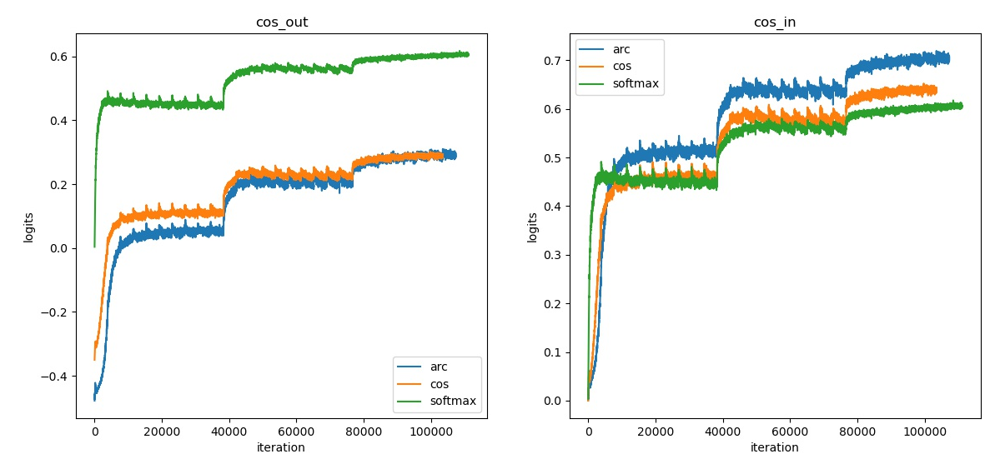
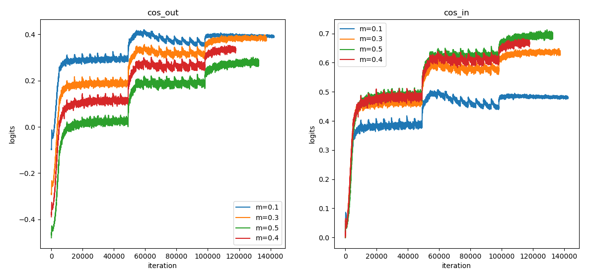
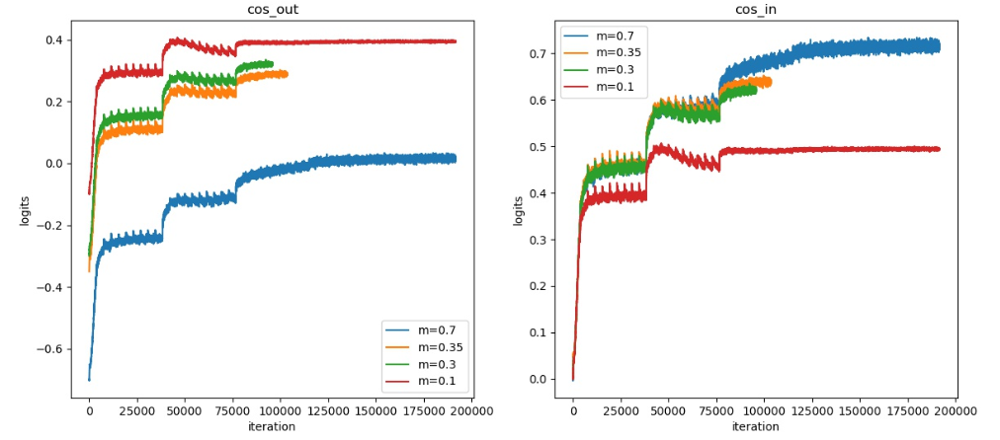
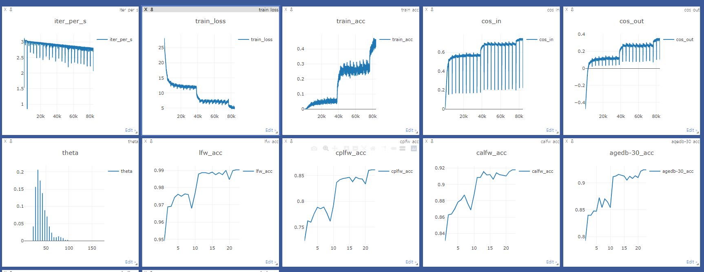

# Face Recognition

Code to train face recognition model and trace the change of theta, the loss function currently implemented are:

* Softmax
* Normsoftmax
* Arcface
* Cosface
* Sphereface
* Mixface

## Environment

The environment can be installed using conda 

```shell
conda install pytorch torchvision bcolz cudatoolkit=10.2 opencv jupyterlab matplotlib pandas flask visdom scikit-learn python-graphviz tornado==4.5.3 imageio jsonpatch -c pytorch -c conda-forge
conda install -c conda-forge easydict
conda install -c conda-forge scikit-image
conda install -c conda-forge tqdm
```

## Dataset

You can download CASIA-Webface and test dataset from [InsightFace](https://github.com/deepinsight/insightface/wiki/Model-Zoo)

The downloaded dataset are saved in `.bin` files and you can use `load_bin.py` in `utils` folder to get the pictures, this will need mxnet package, use `pip install mxnet-cu102` to install it.

It should be noticed that for testset like lfw, the program needs a file named `test_pair.txt` to get testset image pairs. The file is automatically generated by `load_bin.py`. For trainset, you just need to provide the dataset dir and the program will get images automatically from it.
## Usage

Firstly, modify the `config.py` to correct the dataset path and other config variables

```python
# some variables you may change
config.train.dataset = edict(name="webface", path="/path/to/your/dataset")
config.test.dataset = [
    edict(name="lfw", path="/path/to/lfw/test_pair.txt"),
    edict(name="cplfw", path="/path/to/cplfw/test_pair.txt"),
    edict(name="calfw", path="/path/to/calfw/test_pair.txt"),
    edict(name="agedb-30", path="/path/to/agedb-30/test_pair.txt"),
    edict(name="cfp-ff", path="/path/to/cfp-ff/test_pair.txt"),
    edict(name="cfp-fp", path="/path/to/cfp-fp/test_pair.txt"),
]
```
Secondly, start a new shell and run visdom server

```shell
python -m visdom.server
```

Thirdly, run `main.py` to start your train step

```shell
python main.py
```

The `FaceReg` class in `face_reg.py` do the main function, you can use it as follows

```python
# create a instance of the config class
from config import Config
CF = Config()
config = CF.config

# use the config instance to initialize a FaceReg instance
FR = FaceReg(CF)

# train a model
FR.train()

# val a model
FR.val()

# do megaface test (need first enable it in config)
FR.test_megaface()

# save a model
FR.save(save_dir) # to custom path
FR.save() # to default dir (./checkpoint/model/)

# resume a model
FR.resume(resume_dir) # from custom path
FR.resume() # from default dir (./checkpoint/model/)
```

## Result

Webface Dataset, Different Models 

> Id @ 1e6 and Ver @ 1e-6 are megaface test result

| Model         | LFW       | CPLFW      | CALFW      | AGEDB-30   | CFP-FF     | CFP-FP     | Id @ 1e6   | Ver @ 1e-6 |
| ------------- | --------- | ---------- | ---------- | ---------- | ---------- | ---------- | ---------- | ---------- |
| LResNet18E-IR | 0.99      | 0.8578     | 0.9261     | 0.9308     | 0.9931     | 0.9204     | 0.8249     | 0.8654     |
| LResNet34E-IR | 0.9936    | 0.8761     | 0.931      | 0.9441     | 0.995      | 0.9372     | 0.8808     | 0.9163     |
| LResNet50E-IR | **0.995** | **0.8898** | **0.9335** | **0.9455** | **0.9951** | **0.9462** | **0.8989** | **0.9279** |

Webface Dataset, LResNet18E-IR, Different Margin Layer

| Margin              | LFW        | CPLFW      | CALFW      | AGEDB-30   | CFP-FP     | CFP-FF     | Id @ 1e6   | Ver @ 1e-6 |
| ------------------- | ---------- | ---------- | ---------- | ---------- | ---------- | ---------- | ---------- | ---------- |
| Arc (m=0.5)         | 0.99       | 0.8578     | 0.9261     | **0.9308** | 0.9204     | **0.9931** | 0.8249     | 0.8654     |
| Cos (m=0.35)        | **0.9913** | **0.8598** | **0.9265** | 0.9273     | **0.9254** | 0.9924     | **0.8373** | **0.8688** |
| Sphere_Plain (m=4)  | 0.9865     | 0.8245     | 0.9016     | 0.9068     | 0.9167     | 0.9867     | 0.6541     | 0.7213     |
| Sphere_Arc (m=1.35) | 0.987      | 0.8436     | 0.8993     | 0.8963     | 0.9271     | 0.9871     | 0.5572     | 0.5473     |
| Norm                | 0.9776     | 0.7976     | 0.8805     | 0.8745     | 0.87       | 0.9728     | 0.5956     | 0.6099     |
| Softmax             | 0.9878     | 0.841      | 0.9061     | 0.9048     | 0.9142     | 0.9885     | 0.7241     | 0.7773     |

Webface Dataset, LResNet18E-IR, ArcFace, Different Margin Param

| Margin | LFW        | CPLFW     | CALFW      | AGEDB-30   | CFP-FP     | CFP-FF    |
| ------ | ---------- | --------- | ---------- | ---------- | ---------- | --------- |
| m=0.5  | 0.991      | 0.8495    | 0.9221     | 0.9261     | 0.9177     | **0.992** |
| m=0.4  | **0.9915** | **0.857** | **0.9253** | **0.9265** | 0.9238     | **0.992** |
| m=0.3  | 0.9896     | **0.857** | 0.9226     | 0.9241     | **0.9278** | 0.99      |
| m=0.1  | 0.984      | 0.8275    | 0.8985     | 0.8976     | 0.8978     | 0.9817    |

Webface Dataset, LResNet18E-IR, CosFace, Different Margin Param

| Margin | LFW        | CPLFW      | CALFW      | AGEDB-30   | CFP-FP     | CFP-FF     |
| ------ | ---------- | ---------- | ---------- | ---------- | ---------- | ---------- |
| m=0.7  | 0.99       | 0.8465     | 0.9223     | 0.9205     | 0.9141     | 0.9902     |
| m=0.4  | 0.9911     | 0.8591     | **0.9251** | **0.9271** | 0.9205     | 0.9912     |
| m=0.35 | **0.9918** | **0.8603** | 0.9226     | 0.9258     | **0.9217** | **0.9915** |
| m=0.3  | 0.9915     | 0.8601     | 0.9225     | 0.925      | 0.928      | 0.9908     |
| m=0.1  | 0.986      | 0.8293     | 0.9016     | 0.896      | 0.8962     | 0.9824     |

Comparison of `cos_in` (cos(θ) before adding margin) and `cos_out` (cos(θ) after adding margin) with different Margin Layer



Comparison of `cos_in` (cos(θ) before adding margin) and `cos_out` (cos(θ) after adding margin) with different Margin Param

Using ArcFace, Different Marin Param



Using Cosface, Different Margin Param



## Training Log Display

